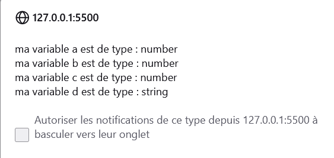
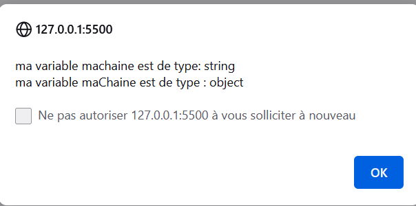
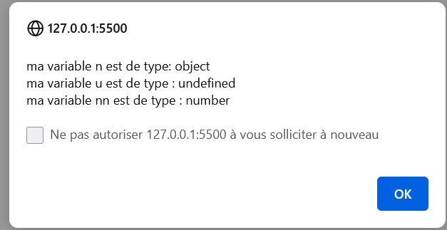

# <p align ="center"> coursjs </p> 

 ## <p align ="center"> Introduction au JavaScript </p>  
 JavaScript est un langage de programmation de scripts principalement employé dans les pages web interactives et à ce titre est une partie essentielle des applications web. Avec les langages HTML et CSS, JavaScript est au cœur des langages utilisés par les développeurs web.


## Qu'est-ce qu'une variable
Une variable est un conteneur servant à stocker des informations de manière temporaire, comme une chaine de caractères (un texte) ou un nombre par exemple.

Le propre d’une variable est de pouvoir varier, c’est-à-dire de pouvoir stocker différentes valeurs au fil du temps.

En PHP, les variables ne servent à stocker une information que temporairement. Plus précisément, une variable ne va exister que durant le temps de l’exécution du script l’utilisant.

Ainsi, on ne va pas pouvoir stocker d’informations durablement avec les variables (pour cela, nous pourrons par exemple utiliser les fichiers, cookies ou les bases de données dont nous parlerons plus tard dans ce cours).

Note : Dans le début de ce cours, nous allons définir nous-mêmes les valeurs qui vont être stockées dans nos variables, ce qui n’a pas beaucoup d’intérêt en pratique. C’est donc tout à fait normal si vous ne voyez pas immédiatement le but d’utiliser des variables. Ici, vous pouvez retenir que les variables vont être vraiment intéressantes lorsqu’elles vont nous servir à stocker des données envoyées par les utilisateurs (via des formulaires par exemple) puisqu’on va ensuite pouvoir manipuler ces données.


Toute variable en PHP doit commencer par le signe $ qui sera suivi du nom de la variable ;
Le nom d’une variable doit obligatoirement commencer par une lettre ou un underscore (_) et ne doit pas commencer par un chiffre ;
Le nom d’une variable ne doit contenir que des lettres, des chiffres et des underscores mais pas de caractères spéciaux ;
Le nom d’une variable ne doit pas contenir d’espace.


Le code ci-dessous sur JavaScript
on affecte à la variable a un nombre positif
on affecte à la variable b un nombre décimale
on affecte à la variable c un nombre négatif
on affecte à la variable d une chaine de caractère string
et on affiche pour chaque variable le type avec la fonction typeof()
```
var a = 42;
var b = 4.2;
var c = -42;
var d = "42";alert("ma variable a est de type : " + typeof(a) +
"\nma variable b est de type : " + typeof(b) +
"\nma variable c est de type : " + typeof(c) +
"\nma variable d est de type : " + typeof(d)
```
La méthode alert() de JavaScript m'affiche une fenêtre
les 3 premières variables sont des nombres et la dernière est un string


Le code ci-dessous sur JavaScript
on a une première variable machaine qui est une chaine de caractère
on a une deuxième variable maChaine qui est l'instance d'un objet String
```
var machaine = "exemple";
var maChaine = new String("exemple");

alert("ma variable machaine est de type: " + typeof(machaine) + 
"\nma variable maChaine est de type : " + typeof(maChaine));

```
La méthode alert() de JavaScript m'affiche une fenêtre
la variable machaine est bien une chaine de caractère
la variable maChaine étant une instance d'un objet String est un objet.


Le code ci-dessous sur  JavaScript
une variable null Whereas, null in JavaScript is an assignment value. You can assign it to a variable.
Une variable undefined It means a variable declared, but no value has been assigned a value.
La propriété globale NaN est une valeur utilisée pour représenter une quantité qui n'est pas un nombre (Not a Number en anglais).


```
var n = null;
var u = undefined;
var nn = NaN;

alert("ma variable n est de type: " + typeof(n) + 
"\nma variable u est de type : " + typeof(u) +
"\nma variable nn est de type : " + typeof(nn));
```
La méthode alert() de JavaScript m'affiche une fenêtre


## les opérateurs mathématiques
var x = 32;
var y = 5;
var z = 2;

// multiplication
alert(y*z);

//division
alert(y/z);

//addition
alert(y + z);

// soustraction 
alert(y - z);

// modulo est le restant d'une division
alert(x % y);

// priorité mathématiques
// la multiplication est prioritaire
alert (y+z*x)
// l'addition est prioritaire
alert((y+z)*x)

// y = y + z équivaut à y += z additionne et affecte
y += z // équivaut à y = y + z renvoi 7 car y = 5 + 2
y *= z // équivaut à y = y * z renvoi 14
y -= z // équivaut à y = y - z renvoi 12
y /= z // équivaut à y = y / z renvoi 6
y %= z // équivaut à y = y % z renvoi 0
// renvoie la valeur de 0 car à chaque fois écrase la valeur précédente
alert(y);

## Opérateurs
opérateurs mathématiques, opérateurs comparaison, opérateur d'affectation sont les 3 types d'opérateurs principaux.
Egal: on compare uniquement la valeur ==
Strictement égal: on va comparer la valeur et le type ===
Cet opérateur de comparaison renvoi un booléen true or false
!= veut dire différent 
!== strictement différent
vrai && vrai renvoit vrai
vrai || faux renvoit vrai   

## Opérateurs de comparaison
| Opérateur | Définition |
| :-------- | :---------|
| == | Permet de tester l'égalité sur les valeurs |
| === | Permet de tester l’égalité en termes de valeurs et de types |
| != | Permet de tester la différence en valeurs |
| <> | Permet également de tester la différence en valeurs |
| !== | Permet de tester la différence en valeurs ou en types |
| < | Permet de tester si une valeur est strictement inférieure à une autre
| > | Permet de tester si une valeur est strictement supérieure à une autre |
| <= | Permet de tester si une valeur est inférieure ou égale à une autre |
| >= | Permet de tester si une valeur est supérieure ou égale à une autre |

## Les tableaux
```
var maChaine ="cda";
var arrayNbr = [1 ,2 ,3];
var arrayStr = ["a","b","c"];


arrayNbr.push(4); // envoie le 4 à la fin du tableau [1 ,2 ,3, 4]
arrayNbr.pop(); // retire le dernier du tableau car renvoi [1,2]
arrayNbr.shift();//Removes the first element from an array and returns it. If the array is empty, undefined is returned and the array is not modified.
arrayNbr.unshift(0); //Inserts new elements, here 0, at the start of an array, and returns the new length of the array.
console.table(arrayNbr); 
console.log(maChaine[1]);

var arrayCopy = arrayStr.concat("d"); //fusionne les tableaux sans changer les valeurs du tableau initiale
console.log(arrayCopy); // créer une copie de tableau. Permet de fusionner au moins 2 tableaux
console.log(arrayStr);

// rq les chaines de caractères viennent d'un tableau
console.log(arrayStr.join('-'));// join les valeurs du tableau sans changer les valeurs initiales séparés par '-'

console.log(arrayStr.slice(1)); // en partant du début [ "b", "c" ]indiquer le nombre d'éléments qu'on souhaite retirer du tableau sans toucher aux valeurs du tableau d'origine
console.log(arrayStr.slice(-1));// en partant de la fin idem

console.log(arrayNbr.reduce((acc, cou) => acc + cou));
console.log(arrayStr.includes("c")); //Determines whether an array includes a certain element, returning true or false as appropriate.
console.log(arrayStr.indexOf("c"));

console.log(arrayNbr.find(el => el > 2)) // 3 renvoie la valeur du premier élément trouvé dans le tableau qui respencte la condition
// dans mon tableau trouve un élément qui est supérieur à 2
// fonction simplifiée en écriture, n'a qu'un seul paramètre et qu'un seul retour
// il s'agit d'une fonction callback
console.log(arrayNbr.findIndex(el => el > 2));
console.log(arrayNbr.map(el => el *2)); // revoit un tableau de chaque élément
console.log(arrayNbr.some(el => el > 2)); // renvoit true si au moins un élément respecte la condition
console.log(arrayNbr.some(el => el > 5)); // renvoit false

console.log(arrayNbr.filter(el => el > 1)); // renvoie 2 et 3
// resemble à find sauf qu'il va renvoyer tous les éléments qui respenctent la condition 

console.log(arrayNbr.every(el => el > 1)); // est-ce que tout les éléments respectent la condition ici renvoit false c'est un booléen
console.log(arrayNbr.reverse()); // inverse tous les éléments qui sont dans le tableau

```
| Méthode | Résultat |
|:-------:|:---------|
| push(4) |  ajoute la valeur indiqué à la fin du tableau ([1, 2, 3, 4])|
 | pop() | [1, 2] retire la dernière valeur|
 | shift() | [2, 3] retire la première valeur|
 | unshift(0) | [0, 1, 2, 3] ajoute la valeur indiqué au début du tableau|
 | concat("d")| fusionne des tableaux sans changer les valeurs du tableau initial|
 | join('-')|  a-b-c joindre les valeurs du tableau sans changer les valeurs du tableau initial|
 | slice(1)|  ["b", "c"] retire le nombre d'éléments indiqué du tableau en partant du début sans changer les valeurs du tableau initial|
 | slice(-1)|  ["b", "c"] retire le nombre d'éléments indiqué du tableau en partant du début et en comptant depuis la fin sans changer les valeurs du tableau initial|
 | includes("c")| true vérifie si la valeur existe|
 | indexOf("c")| 2 renvoi le position (index) de la valeur dans le tableau|
 | reduce((acc, cou)=> acc + cou ) |  additionne tous les éléments du tableau|